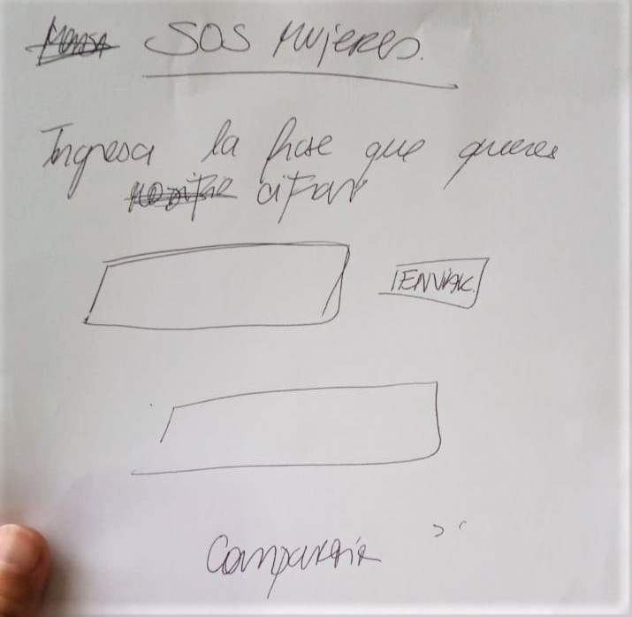
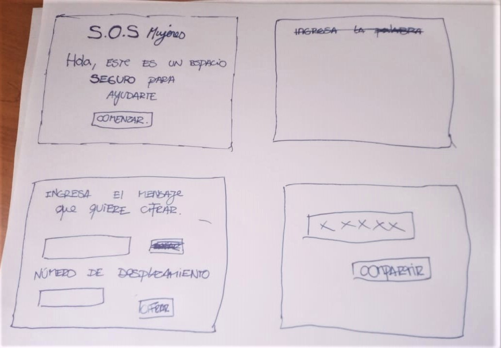
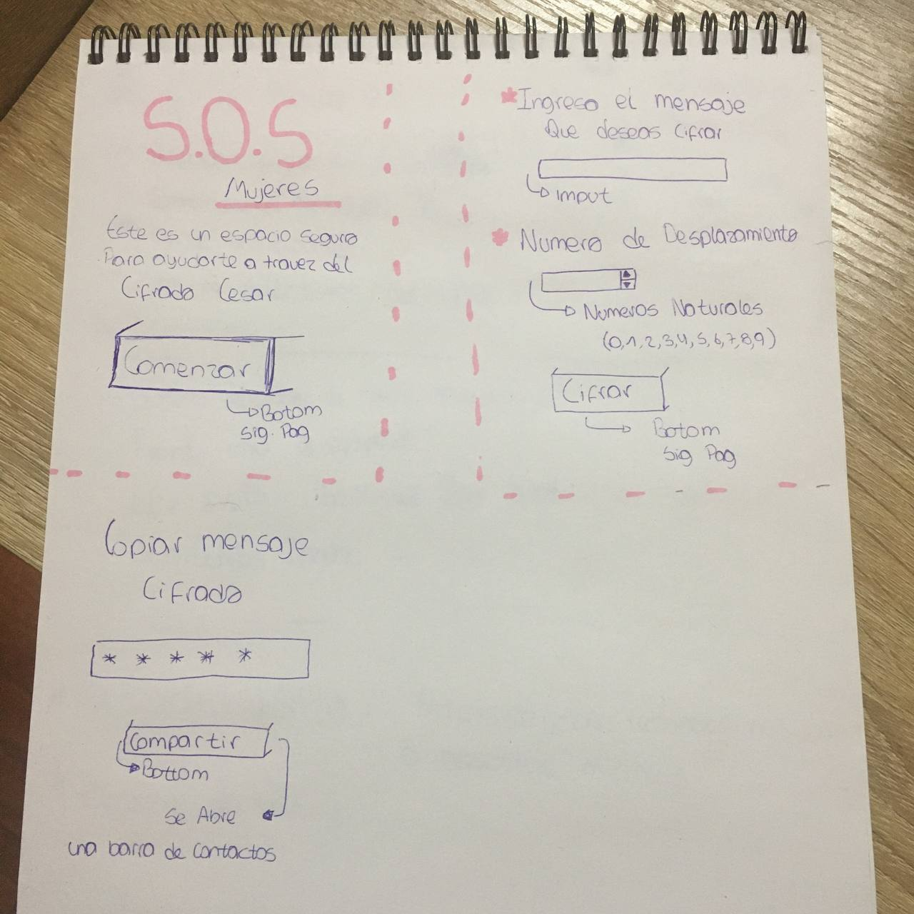
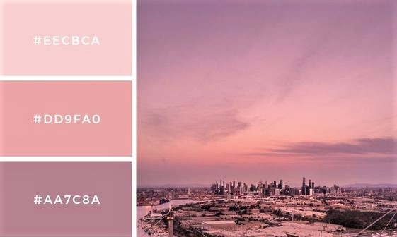
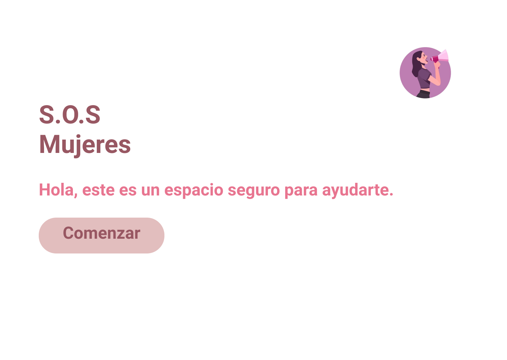
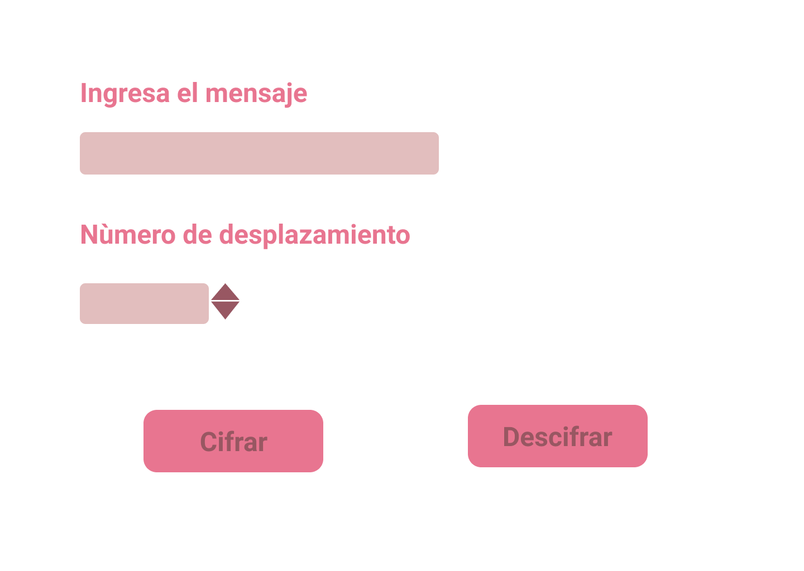
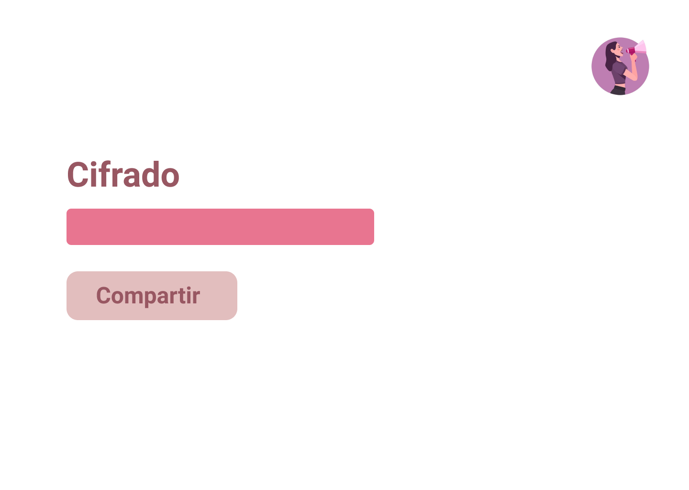
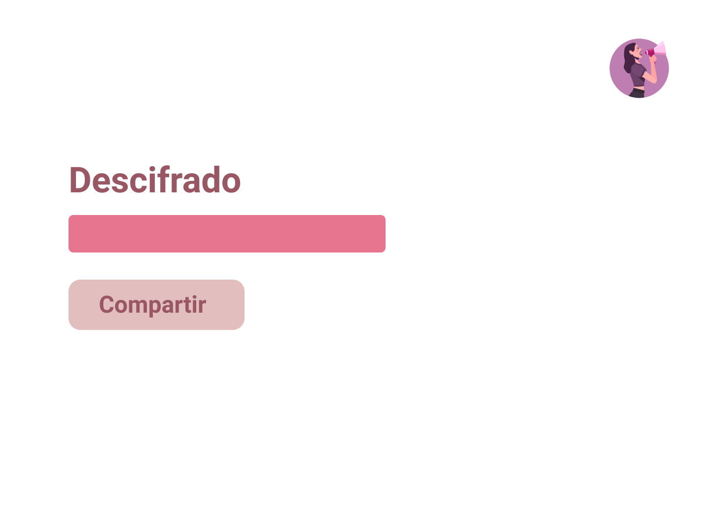

# Cifrado César

## Preámbulo
La violencia contra las mujeres es una pandemia mundial, y América Latina y el Caribe es la región más violenta para ellas. Esto, en gran medida, se atribuye a que la cultura patriarcal tan arraigada rige prácticamente todas las costumbres y prácticas de la vida diaria, las cuales han relegado y limitado los derechos y libertades de las mujeres.
Es por esto que como un método de prevenir o colaborar en situaciones de emergencia hemos decidido crear *S.O.S MUJERES* 

## 1.Proceso y decisiones de diseño.
Nuestro proyecto consiste en una aplicación que cifra y decifra mensajes enviados en casos de emergencia, ya sea situaciones de violencia física o psicológica, la aplicación se presenta de forma directa e intuitiva, se dispone de un *imput text* y *imput number* en donde ingresan el mensaje y el número de desplazamiento y dos botones en donde se selecciona la opción a realizar, ya seas un *receptor* del mensaje (Decifrar) o un *emisor* del mensaje (Cifrar).

## 2.Usuarias y relación con el producto.
Nuestras principales usuarias son mujeres que se vean expuestas a casos de violencia y necesiten alertar a sus cercanos situaciones en donde su bienestar y seguridad esté siendo vulnerados, es por esto que luego de cada proceso de cifrado se emite un botón en donde ellas tienen la opción de compartir el mensaje con sus contactos de confianza, también nuestra plataforma cuenta con un sistema de decifrado el cual les permite a los usuarios de confianza poder ingresar el mensaje cifrado y ver el mensaje real.

## 3.Abarcando necesidades de las usuarias.
Con nuestra página web buscamos entregarle un producto ágil a nuestras usuarias, debido a que en el momento que ellas requieran nuestro servicio no se encuentren con trabas o limitaciones que le compliquen su experiencia de usuario, dadas las circunstancias en la cual recurririan a nuestra aplicación.

## 4. Prototipos.
### Prototipos de Baja Fidelidad:

*Prototipo 1* 
   
*Prototipo 2* 
   
*Prototipo 3* 
   
*Paletas de colores*
   

### Prototipos de Alta Fidelidad:

*Pantalla 1* 
   
*Pantalla 2* 
   
*Pantalla 3* 
   
*Pantalla 4* 
   